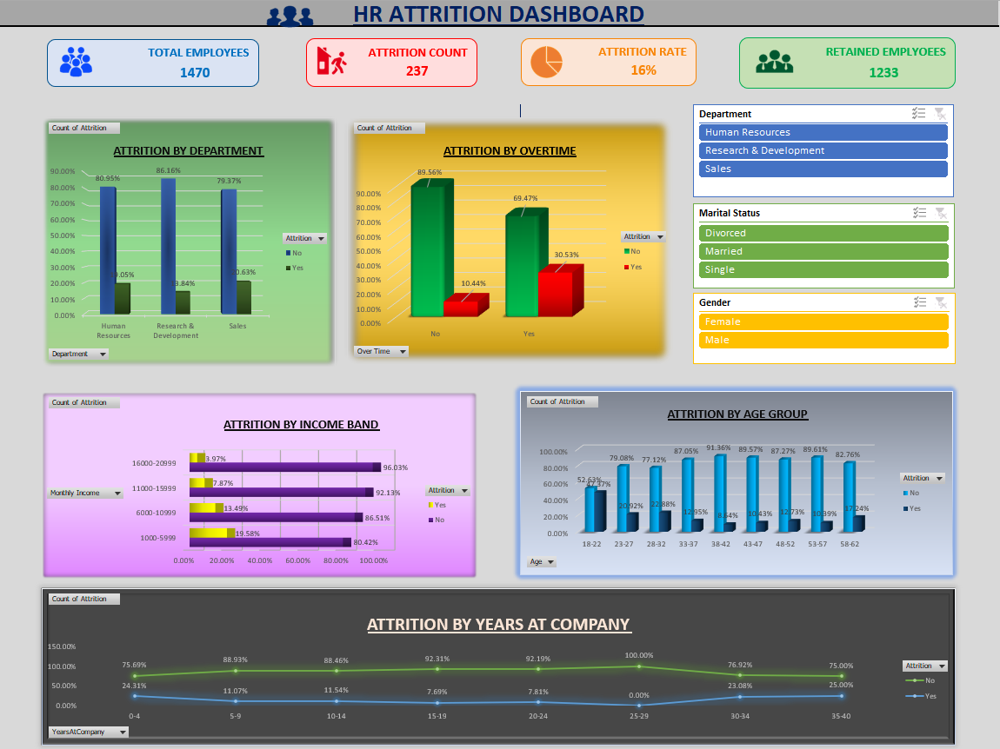

# HR Attrition Analysis Dashboard (Excel)

## Project Overview

This project analyzes employee attrition using Microsoft Excel and presents key HR insights through an interactive dashboard.

The objective was to identify the major factors influencing employee attrition and provide business-friendly visualizations for HR decision-making.

---

## Business Problem

Employee attrition affects productivity, hiring costs, and organizational performance.

This dashboard helps answer questions such as:

- Which department has the highest attrition?
- Does overtime increase employee turnover?
- Does monthly income influence attrition?
- Which age groups leave the company more frequently?
- How does employee tenure impact attrition?

---

## Tools Used

- Microsoft Excel
- Pivot Tables
- Pivot Charts
- Slicers
- Excel Formulas
- Conditional Formatting

---

## KPI Summary

| KPI | Value |
|------|------:|
| Total Employees | 1470 |
| Total Attrition | 237 |
| Attrition Rate | 16% |
| Retained Employees | 1233 |

---

## Key Business Insights

- Sales department has the highest attrition rate.
- Employees working overtime are significantly more likely to leave.
- Lower-income employees show higher attrition.
- Employees with less than 5 years at the company leave more frequently.
- Younger employees (18–32 years) have the highest attrition.

---

## Dashboard Features

- Interactive KPI Cards
- Department-wise Analysis
- Monthly Income Analysis
- Overtime Analysis
- Age-wise Attrition
- Years at Company Analysis
- Interactive Slicers

---

## Files Included

- HR_Attrition_Dashboard.xlsx
- IBM-HR-Employee-Attrition.csv
- Dashboard.png.png

---

## Skills Demonstrated

- Business Analysis
- Data Cleaning
- Data Visualization
- Excel Dashboard Design
- KPI Reporting
- HR Analytics
- Data Storytelling

---

## Author

**Sharmilee Manna**

Aspiring Business Analyst
